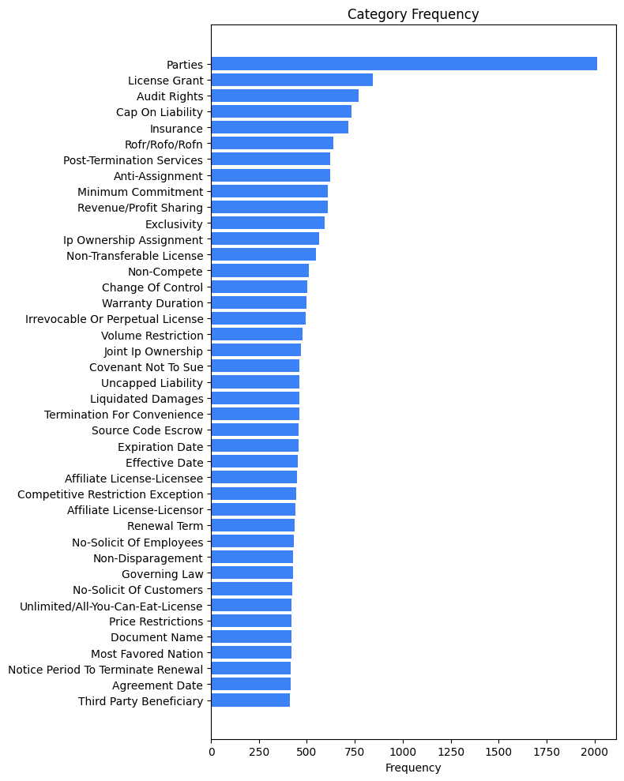
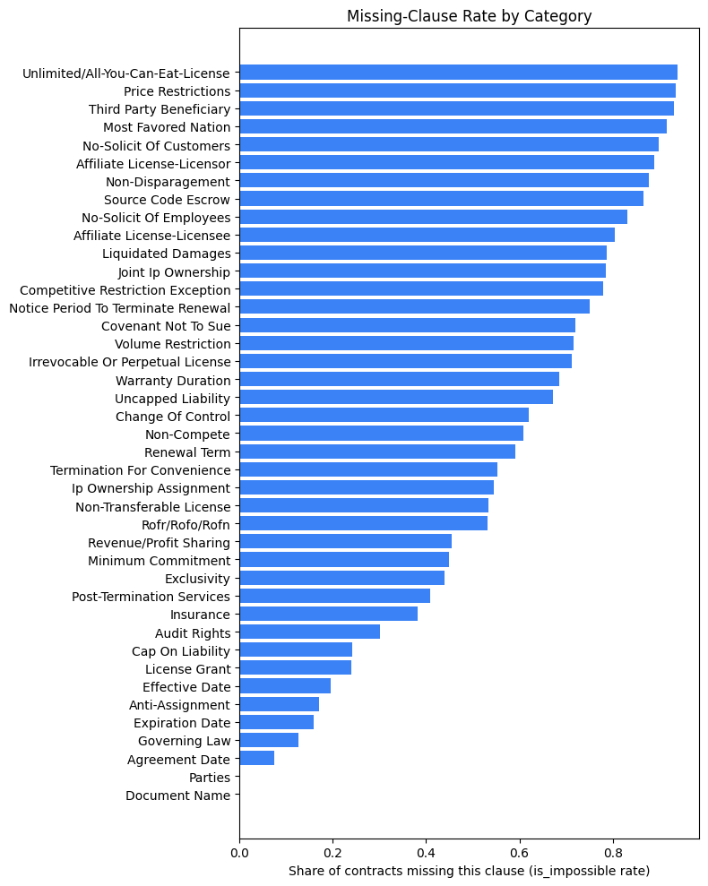
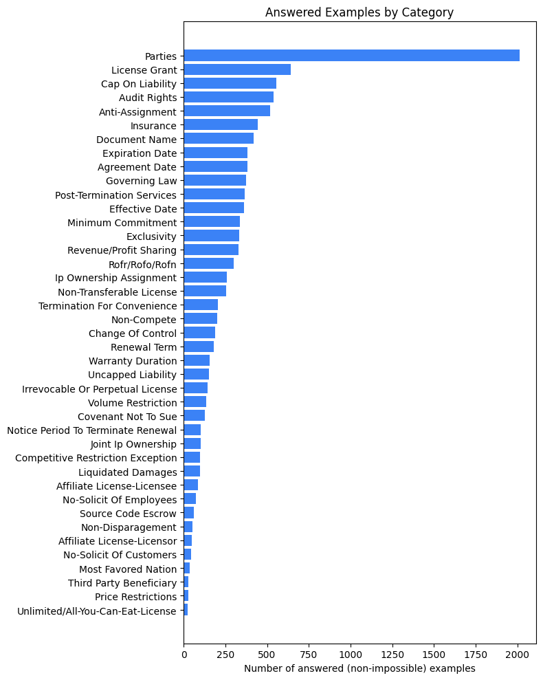
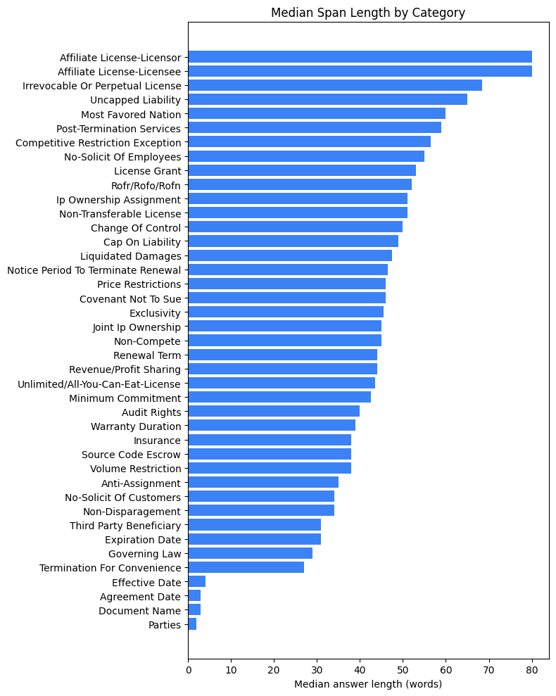
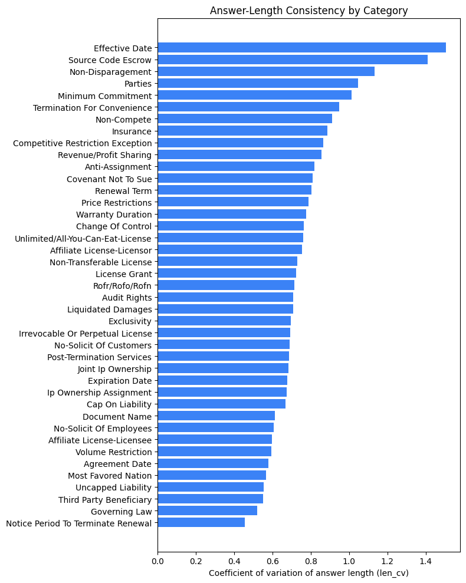

# September Milestone Report

## Selecting 10 Core Categories

### Proposed 10 core categories

1. Parties
2. Document Name
3. Agreement Date
4. Governing Law
5. Expiration Date
6. Anti-Assignment
7. License Grant _(highest number of answerable questions, lowest impossibility rate)_
8. Cap On Liability _(best single representative of the liability cluster)_
9. Audit Rights
10. Exclusivity _(best single representative of the competitive-restraint cluster)_

### Justification

Per the challenge project overview, we need to narrow the 41 categories down to 10 core categories to focus on. Beyond high raw frequency and low impossibility rate, we consider:

- **Class balance**: absolute number of answered (non-impossible) examples per category. A low impossibility rate alone doesn't automatically make a category a good candidate to focus on; categories can contain few impossible q/as but be infrequent overall. Absolute number of answerable examples balances frequency and impossibility.

- **Label quality/consistency**: coefficient of variation (std/mean) of `answer_text` length. Unlike variance and standard deviation, CV is a unitless measure that allows us to account for differences in mean answer/clause length and directly compare variation across categories. A high CV suggests annotators captured wildly different granularities under the same category (e.g. sometimes a single date, sometimes a whole clause), which is noisier to model and evaluate.

- **Span extraction difficulty**: median word count of `answer_text`. Very short spans (names, dates) are close to trivial extraction; very long spans are harder to extract cleanly, as they are liable to be broken across multiple chunks. Chunking for mid-length, or median clause-length, spans allows each chunk to contain clauses while not blurring multiple clauses into single units of information. Choosing categories with substantial-length, low-variation spans allows for simpler chunking strategies down the line.

- **Redundancy**: several categories cluster around the same legal concept (e.g. `Exclusivity` / `Non-Compete` / `Competitive Restriction Exception`, or `Cap On Liability` / `Uncapped Liability`, or the `License Grant` / `Non-Transferable License` / `Affiliate License` family). We prefer one strong representative per cluster rather than several near-duplicates, to reduce noise and expand model versatility. Strong representatives display the above traits.

#### Category frequency

The 41 categories are highly imbalanced in raw frequency, with `Parties` the mode by a wide margin:

> The majority of questions are under the category Parties: 2012 questions
> Parties description: The two or more parties who signed the contract

#### Missing-clause rate by category

`is_impossible` marks a question with no answer in the contract (i.e. the clause type is absent):

`Document Name` questions were never impossible, given that the dataset always includes the name of the document. `Parties`, the most common category, had a near-zero rate of impossible clauses.

### Analyzing metrics by category

### Comparing near-duplicate categories

**Trade restraint cluster** — `Exclusivity` / `Non-Compete` / `Competitive Restriction Exception`:

<table border="1" class="dataframe">
  <thead>
    <tr style="text-align: right;">
      <th></th>
      <th>n_answered</th>
      <th>impossible_rate</th>
      <th>words_median</th>
      <th>len_mean</th>
      <th>len_std</th>
      <th>len_cv</th>
    </tr>
  </thead>
  <tbody>
    <tr><th>Exclusivity</th><td>332</td><td>0.44</td><td>45.5</td><td>356.44</td><td>248.13</td><td>0.70</td></tr>
    <tr><th>Non-Compete</th><td>200</td><td>0.61</td><td>45.0</td><td>385.30</td><td>351.47</td><td>0.91</td></tr>
    <tr><th>Competitive Restriction Exception</th><td>98</td><td>0.78</td><td>56.5</td><td>468.88</td><td>405.27</td><td>0.86</td></tr>
  </tbody>
</table>

**Liability cluster** — `Cap On Liability` / `Uncapped Liability`:

<table border="1" class="dataframe">
  <thead>
    <tr style="text-align: right;">
      <th></th>
      <th>n_answered</th>
      <th>impossible_rate</th>
      <th>words_median</th>
      <th>len_mean</th>
      <th>len_std</th>
      <th>len_cv</th>
    </tr>
  </thead>
  <tbody>
    <tr><th>Cap On Liability</th><td>554</td><td>0.24</td><td>49.0</td><td>379.85</td><td>254.17</td><td>0.67</td></tr>
    <tr><th>Uncapped Liability</th><td>151</td><td>0.67</td><td>65.0</td><td>447.68</td><td>247.98</td><td>0.55</td></tr>
  </tbody>
</table>

**License cluster** — `License Grant` / `Non-Transferable License` / `Affiliate License-Licensor`:

<table border="1" class="dataframe">
  <thead>
    <tr style="text-align: right;">
      <th></th>
      <th>n_answered</th>
      <th>impossible_rate</th>
      <th>words_median</th>
      <th>len_mean</th>
      <th>len_std</th>
      <th>len_cv</th>
    </tr>
  </thead>
  <tbody>
    <tr><th>License Grant</th><td>642</td><td>0.24</td><td>53.0</td><td>431.48</td><td>312.68</td><td>0.72</td></tr>
    <tr><th>Non-Transferable License</th><td>255</td><td>0.53</td><td>51.0</td><td>435.25</td><td>317.46</td><td>0.73</td></tr>
    <tr><th>Affiliate License-Licensor</th><td>49</td><td>0.89</td><td>80.0</td><td>601.41</td><td>452.58</td><td>0.75</td></tr>
  </tbody>
</table>

### Reading the tables

- **Class balance**: For splitting this set into training and validation, we aim to keep at least 30 samples per partition. Given a typical 80-20 train-validation split, we aim for categories with at least 150 samples, ruling out the 17 categories from `Irrevocable Or Perpetual License` to `Unlimited/All-You-Can-Eat-License.` `Parties` through `Rofr/Rofo/Rofn` (n_answered >= ~300) are all safe candidates.

- **Label consistency (`len_cv`)**:
  - `Effective Date` (~1.5) and `Minimum Commitment` (~1.0) have highly inconsistent span lengths, suggesting inconsistent annotation granularity.
  - `Governing Law`, `Uncapped Liability`, and `Notice Period To Terminate Renewal` are the most consistent (lowest CV). `Third Party Beneficiary` is ruled out due to low sample size (n=28).

- **Span difficulty (`words_median`)**:
  - `Parties`, `Document Name`, `Agreement Date`, `Effective Date` are trivially short (2-4 words), which are simple to extract but not very representative of a typical legal clause.
  - `License Grant`, `Cap On Liability`, `Audit Rights`, `Post-Termination Services` are mid-to-long spans that better represent typical legal clauses while remaining tractable to chunk.

- **Redundancy**: among the viable candidates, avoid picking more than one from the same cluster. Overlapping categories include:
  - Trade restraint: `Exclusivity` / `Non-Compete` / `Competitive Restriction Exception`
    - `Exclusivity` has the most answerable questions, lowest impossibility rate, and lowest coefficient of variance.
  - Liability: `Cap On Liability` / `Uncapped Liability`
    - `Cap On Liability` has a slightly higher coefficient of variance (0.67 vs 0.55), but it has a much higher number of answerable examples and much lower impossibility rate, making it a better candidate overall.
  - Licenses: `License Grant` / `Non-Transferable License` / `Affiliate License-Licensor`
    - `License Grant` has the highest number of answerables, the lowest impossibility, and the lowest coefficient of variance.
